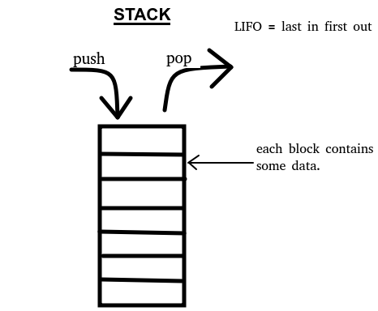

# **Data Structures in C : main structures and operations** 
Some operations on different data structures that can always come in handy.

### **Some definitions**: 

#### **stack** : 

A stack is a linear data structure. here's a quick sketch :  

The three main operations that are performed in a Stack are:

    * Push: Adds an item in the stack.
    * Pop: Removes an item from the stack. The items are popped in the reversed order in which they are pushed. 
    * Peek or Top: Returns top element of stack.
    * isEmpty: Returns true if stack is empty, else false.

#### **queue** :
