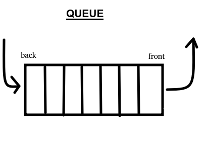

# **Data Structures in C : main structures and operations** 
Some operations on different data structures that can always come in handy.

## **Some definitions**: 

## **stack** : 

A stack is a linear data structure. here's a quick sketch :  

The three main operations that are performed on a Stack are:

* Push: Adds an item in the stack.
* Pop: Removes an item from the stack. The items are popped in the reversed order in which they are pushed. 
* Peek or Top: Returns top element of stack.
* usual stuff (length, checking if empty)

## **queue** : 
A queue is a collection of elements (as is a stack and every other data structure). What makes it different is that elements can be added at the end and taken out at the front only (FIFO --> First in First out). It's just like a line at the supermarket. Here's a sketch : 

The main operations that are performed on a queue are:

* enqueue : adding an element at the back of the queue
* dequeue : taking an element out of the front of the queue
* check beginning or end of the queue
* usual stuff (length, checking if empty)

