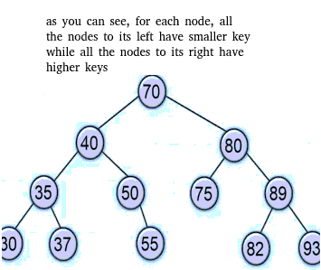

# avl tree (self balancing binary search tree)

An AVL is first of all a binary search tree. A binary search tree is a data structure whose internal nodes all have a higher key value than all the keys in a given node's left subtree and less than those in the right subtree. It's used to store numbers in an organized way and to reduce complexity on certain operations.  

*A binary search tree :* 

What makes a binary search tree an AVL is the fact that in an AVL tree, the heights of the two child subtrees of any node cannot differ by more than one. If that were to happen at any point of insertion or deletion of nodes in the tree, rebalancing is done to restore this propriety through ***rotations*** (that also keep the properties necessary to be a binary search tree).

